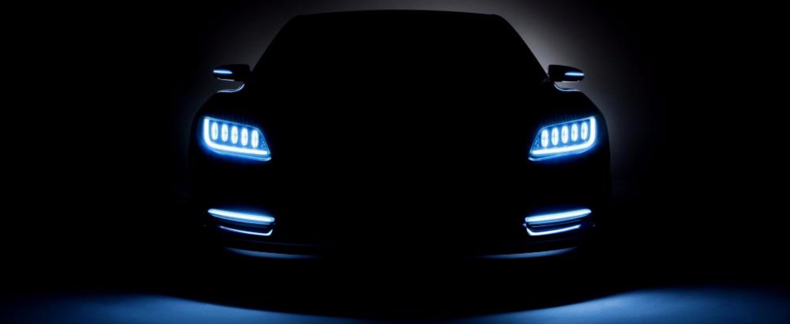

# Self-Driving

  

目前更新如下两部分教程，每一部分的注解会放在README或者Jupyter notebook当中。

MIT 6.S094: Deep Learning for Self-Driving Cars

- Deep Traffic
- SegFuse

Udacity
- Line Dectect
- Traffic Sign Classifier

The rest is coming soon.

### **参考资源**

[MIT 6.S094 Deep Learning for Self-Driving Cars](<https://selfdrivingcars.mit.edu/>)

[MIT 6.S094 视频课程](<https://ai.yanxishe.com/page/groupDetail/21>)

[Udacity Github](<https://github.com/udacity>)

[Udacity Self-driving Car Simulator](<https://github.com/udacity/self-driving-car-sim>)

[Udacity Term-1 中文教程](<https://github.com/yajian/self-driving-car>)

[Udacity Term-1 Tutorial](<https://github.com/jessicayung/self-driving-car-nd>)