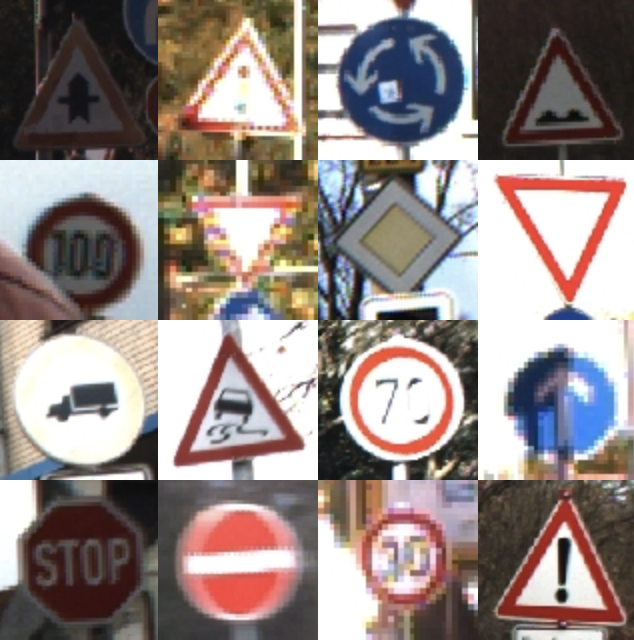
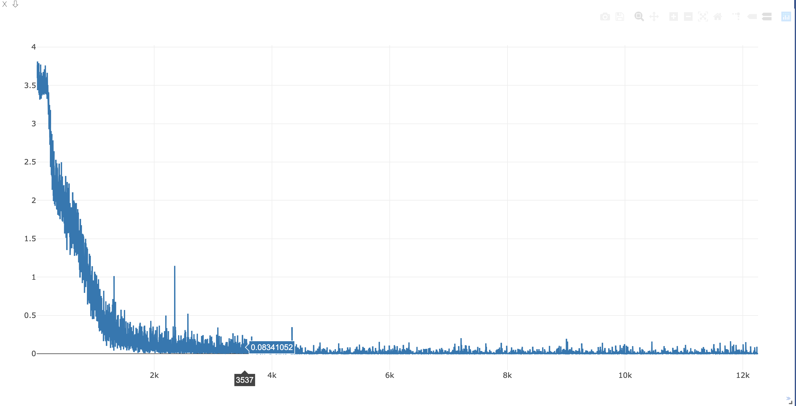

# Traffic Sign Classifier

项目文件[来源](<https://github.com/udacity/CarND-Traffic-Sign-Classifier-Project>)

数据集[German Traffic Sign](<http://benchmark.ini.rub.de/?section=gtsrb&subsection=dataset>)，(是分类数据集，不要下载成检测数据集)，包含42种交通标志。

###  **交通标志分类**

---

## Overview

- Single-image, multi-class classification problem
- More than 40 classes
- More than 50,000 images in total
- Large, lifelike database
- Reliable ground-truth data due to semi-automatic annotation
- Physical traffic sign instances are unique within the dataset 
  (i.e., each real-world traffic sign only occurs once)

## Structure

The training set archive is structures as follows:

- One directory per class
- Each directory contains one CSV file with annotations ("GT-<ClassID>.csv") and the training images
- Training images are grouped by tracks
- Each track contains 30 images of one single physical traffic sign

## Image format

- The images contain one traffic sign each
- Images contain a border of 10 % around the actual traffic sign (at least 5 pixels) to allow for edge-based approaches
- Images are stored in PPM format ([Portable Pixmap, P6](http://en.wikipedia.org/wiki/Netpbm_format))
- Image sizes vary between 15x15 to 250x250 pixels
- Images are not necessarily squared
- The actual traffic sign is not necessarily centered within the image.This is true for images that were close to the image border in the full camera image
- The bounding box of the traffic sign is part of the annotatinos (see below)

 ## Annotation format

Annotations are provided in CSV files. Fields are separated by ";"   (semicolon). Annotations contain the following information:

- **Filename**: Filename of corresponding image
- **Width**: Width of the image
- **Height**: Height of the image
- **ROI.x1**: X-coordinate of top-left corner of traffic sign bounding box
- **ROI.y1**: Y-coordinate of top-left corner of traffic sign bounding box
- **ROI.x2**: X-coordinate of bottom-right corner of traffic sign bounding box
- **ROI.y2**: Y-coordinate of bottom-right corner of traffic sign bounding box

The training data annotations will additionally contain 

- **ClassId**: Assigned class label

### **分类结果**

---

我只训练了20个epoch，应该还不是最优结果，增加epoch或者对网络进行调优应该可以有更高的提升，目前基本完成交通标志分类任务。

| epoch | loss  | train_acc | test_acc |
| :---: | :---: | :-------: | :------: |
|  *1   | 2.575 |  25.32%   |  46.06%  |
|  *2   | 0.932 |  69.89%   |  87.45%  |
|  *3   | 0.215 |  93.58%   |  91.63%  |
|  *4   | 0.106 |  96.96%   |  93.21%  |
|  *5   | 0.064 |  98.24%   |  95.61%  |
|  *6   | 0.045 |  98.67%   |  96.75%  |
|  *7   | 0.014 |  99.62%   |  97.30%  |
|  *8   | 0.009 |  99.74%   |  97.53%  |
|  *10  | 0.007 |  99.79%   |  97.59%  |
|  *14  | 0.005 |  99.83%   |  97.62%  |

Best at epoch 14, test accuaray 97.624702

